# BÁO CÁO ĐỒ ÁN TỐT NGHIỆP
## HỆ THỐNG QUẢN LÝ NHÀ HÀNG VÀ ĐẶT MÓN ĂN TRỰC TUYẾN

---

## CHƯƠNG 1: GIỚI THIỆU ĐỀ TÀI

### 1.1 Lý do chọn đề tài

Trong bối cảnh công nghệ số phát triển mạnh mẽ và nhu cầu đặt món ăn trực tuyến ngày càng tăng cao, việc xây dựng một hệ thống quản lý nhà hàng và đặt món ăn trực tuyến trở thành một giải pháp thiết thực và cần thiết. Hệ thống này giải quyết các vấn đề:

- **Khách hàng**: Cần một nền tảng tiện lợi để tìm kiếm, xem thông tin nhà hàng, đặt món ăn và thanh toán trực tuyến một cách nhanh chóng và an toàn.
- **Chủ nhà hàng (Merchant)**: Cần công cụ quản lý hiệu quả để quản lý menu, đơn hàng, nhân viên và theo dõi doanh thu.
- **Quản trị viên (Admin)**: Cần hệ thống quản lý tập trung để kiểm soát toàn bộ hoạt động của nền tảng, phê duyệt merchant, quản lý người dùng và đảm bảo chất lượng dịch vụ.

Đề tài này không chỉ áp dụng các công nghệ hiện đại như microservices, real-time communication mà còn tích hợp các tính năng thanh toán trực tuyến, chat real-time, và hệ thống đánh giá, tạo nên một nền tảng hoàn chỉnh và chuyên nghiệp.

### 1.2 Mục tiêu

Hệ thống được xây dựng nhằm giải quyết các bài toán cụ thể sau:

1. **Quản lý nhà hàng và menu**: Cho phép merchant đăng ký, quản lý thông tin nhà hàng, thêm/sửa/xóa món ăn với nhiều kích cỡ và giá khác nhau. Hệ thống hỗ trợ upload ảnh, phân loại món ăn theo danh mục, và quản lý trạng thái sẵn có của món.

2. **Đặt món và thanh toán trực tuyến**: Khách hàng có thể tìm kiếm nhà hàng theo vị trí, danh mục, xem chi tiết món ăn, thêm vào giỏ hàng và đặt hàng. Hệ thống hỗ trợ nhiều phương thức thanh toán: tiền mặt, thẻ tín dụng (Stripe), và ví điện tử nội bộ. Tính năng đặt nhóm (Group Order) cho phép nhiều người cùng đặt chung một đơn hàng.

3. **Giao tiếp real-time**: Hệ thống chat real-time giữa khách hàng và merchant sử dụng WebSocket/STOMP, cho phép trao đổi thông tin về đơn hàng, yêu cầu đặc biệt một cách tức thời. Hệ thống lưu trữ lịch sử chat và hỗ trợ đánh dấu tin nhắn đã đọc.

### 1.3 Phạm vi thực hiện

**Đối tượng**: Hệ thống phục vụ cho ba nhóm người dùng chính:
- **Khách hàng (User)**: Người dùng cuối sử dụng ứng dụng để tìm kiếm nhà hàng, đặt món ăn, thanh toán và theo dõi đơn hàng.
- **Chủ nhà hàng (Merchant)**: Quản lý nhà hàng của mình, menu, đơn hàng, nhân viên và xem báo cáo doanh thu.
- **Quản trị viên (Admin)**: Quản lý toàn bộ hệ thống, phê duyệt yêu cầu merchant, quản lý người dùng, nhà hàng, danh mục và khuyến mãi.

**Giới hạn**: Tập trung vào các nghiệp vụ chính:
- Quản lý người dùng và xác thực (đăng ký, đăng nhập, xác thực email, 2FA)
- Quản lý nhà hàng và sản phẩm (CRUD operations)
- Đặt hàng và quản lý giỏ hàng
- Thanh toán trực tuyến (Stripe, ví điện tử)
- Chat real-time giữa user và merchant
- Hệ thống đánh giá và review
- Blog và tin tức về ẩm thực
- Quản lý địa chỉ giao hàng

**Ngoài phạm vi**: 
- Ứng dụng mobile (chỉ tập trung vào web application)
- Tích hợp với các dịch vụ giao hàng bên thứ ba (Grab, Gojek)
- Hệ thống thông báo push notification trên mobile
- Tích hợp AI để đề xuất món ăn

### 1.4 Bố cục báo cáo

Báo cáo được chia thành 5 chương chính:

- **Chương 1 - Giới thiệu đề tài**: Trình bày lý do chọn đề tài, mục tiêu, phạm vi và bố cục báo cáo.
- **Chương 2 - Công nghệ sử dụng**: Giới thiệu các công nghệ, framework, cơ sở dữ liệu và công cụ hỗ trợ được sử dụng trong dự án, giải thích lý do lựa chọn và ưu điểm của chúng.
- **Chương 3 - Phân tích và thiết kế hệ thống**: Mô tả kiến trúc hệ thống (microservices), các thành phần, phân tích use case, sơ đồ hoạt động và thiết kế cơ sở dữ liệu (ERD).
- **Chương 4 - Thiết kế màn hình**: Trình bày sơ đồ liên kết màn hình, danh sách các màn hình đã xây dựng và mô tả chi tiết các thành phần trên mỗi màn hình.
- **Chương 5 - Kết luận**: Tổng kết những gì đã đạt được, ưu điểm, hạn chế và hướng phát triển trong tương lai.

---

## CHƯƠNG 2: CÔNG NGHỆ SỬ DỤNG

### 2.1 Ngôn ngữ lập trình và Framework

#### 2.1.1 Frontend: Next.js 15 với React 19

**Next.js 15** là framework React tiên tiến được chọn làm nền tảng cho phần frontend của hệ thống. Các ưu điểm vượt trội:

- **Server-Side Rendering (SSR) và Static Site Generation (SSG)**: Next.js tự động tối ưu hóa việc render trang, giúp cải thiện SEO và tốc độ tải trang đáng kể. Điều này đặc biệt quan trọng cho các trang công khai như danh sách nhà hàng, blog.

- **App Router**: Sử dụng App Router mới của Next.js 15 với cấu trúc thư mục dựa trên file system, giúp tổ chức code rõ ràng và dễ bảo trì. Hỗ trợ Server Components và Client Components, cho phép tối ưu hóa hiệu suất bằng cách render một phần trên server.

- **API Routes tích hợp**: Next.js cho phép tạo API endpoints ngay trong ứng dụng, tuy nhiên trong dự án này chúng ta sử dụng backend riêng biệt để tận dụng microservices architecture.

- **Image Optimization**: Tự động tối ưu hóa hình ảnh với nhiều format (WebP, AVIF), lazy loading và responsive images, giúp giảm bandwidth và cải thiện trải nghiệm người dùng.

- **Turbopack**: Sử dụng Turbopack (bundler mới của Next.js) để tăng tốc độ build và hot reload trong quá trình phát triển.

**React 19** với các tính năng mới:
- **Server Components**: Cho phép render component trên server, giảm JavaScript bundle size.
- **Automatic Batching**: Tự động batch các state updates để tối ưu re-render.
- **Concurrent Rendering**: Hỗ trợ render không chặn, cải thiện responsiveness của UI.

**So sánh với các công nghệ khác**:
- **So với React thuần**: Next.js cung cấp routing, SSR, và optimization out-of-the-box, không cần cấu hình phức tạp như khi dùng React với React Router và các thư viện khác.
- **So với Vue.js/Nuxt**: Next.js có ecosystem lớn hơn, nhiều thư viện hỗ trợ hơn, và phù hợp với team đã quen với React.
- **So với Angular**: Next.js nhẹ hơn, học curve thấp hơn, và phù hợp với các dự án cần flexibility cao.

#### 2.1.2 Backend: Spring Boot (Java) và Node.js

**Spring Boot (Java)** được sử dụng cho các microservices chính:

- **user-service**: Quản lý người dùng, xác thực, phân quyền
- **restaurant-service**: Quản lý nhà hàng, sản phẩm, danh mục
- **chat-service**: Xử lý chat real-time với WebSocket/STOMP
- **notification-service**: Gửi email thông báo
- **api-gateway**: Điểm vào duy nhất, routing và authentication
- **service-discovery**: Eureka server để service discovery

**Ưu điểm của Spring Boot**:
- **Dependency Injection**: Quản lý dependencies tự động, code dễ test và maintain.
- **Spring Security**: Framework bảo mật mạnh mẽ, hỗ trợ JWT, OAuth2.
- **Spring Data JPA**: ORM mạnh mẽ, giảm boilerplate code khi làm việc với database.
- **Spring Cloud**: Tích hợp sẵn với Eureka, Gateway, Config Server cho microservices.
- **Mature Ecosystem**: Nhiều thư viện và community support lớn.

**Node.js** được sử dụng cho các services cần xử lý I/O nhiều:

- **order-service**: Quản lý đơn hàng, giỏ hàng, group orders
- **payment-service**: Xử lý thanh toán với Stripe, quản lý ví điện tử
- **blog-service**: Quản lý blog với MongoDB

**Ưu điểm của Node.js**:
- **Non-blocking I/O**: Xử lý nhiều request đồng thời hiệu quả, phù hợp với real-time applications.
- **NPM Ecosystem**: Thư viện phong phú, dễ tích hợp với các dịch vụ bên thứ ba.
- **JSON Native**: Làm việc với JSON thuận tiện, phù hợp với REST APIs và MongoDB.
- **Fast Development**: Code nhanh, deploy dễ dàng.

**Lý do kết hợp cả hai**:
- Spring Boot phù hợp cho các services cần transaction management và data consistency cao (user, restaurant).
- Node.js phù hợp cho các services cần xử lý real-time và I/O intensive (order, payment, chat).

### 2.2 Cơ sở dữ liệu

#### 2.2.1 MySQL

MySQL được sử dụng cho các services cần quan hệ dữ liệu phức tạp và ACID compliance:

- **user-service**: Bảng `users`, `address`
- **restaurant-service**: Bảng `restaurants`, `products`, `categories`, `product_sizes`, `reviews`
- **chat-service**: Bảng `chat_rooms`, `messages`
- **payment-service**: Bảng `payments`, `wallets`, `wallet_transactions`, `payout_requests`

**Lý do chọn MySQL**:
- **ACID Compliance**: Đảm bảo tính nhất quán dữ liệu cho các transaction quan trọng như thanh toán, đặt hàng.
- **Relational Data**: Dữ liệu có quan hệ phức tạp (restaurant-category, product-size, order-item) phù hợp với mô hình quan hệ.
- **Mature và Stable**: Đã được sử dụng rộng rãi, có nhiều công cụ quản lý và monitoring.
- **Performance**: Với proper indexing, MySQL có thể xử lý hàng triệu records hiệu quả.

**Cấu trúc dữ liệu phù hợp**:
- Quan hệ Many-to-Many: `restaurant_categories` (nhiều nhà hàng - nhiều danh mục)
- Quan hệ One-to-Many: `restaurants` → `products` → `product_sizes`
- Foreign keys và indexes được sử dụng để đảm bảo data integrity và query performance.

#### 2.2.2 MongoDB

MongoDB được sử dụng cho **blog-service** và **order-service** (một phần):

**Lý do chọn MongoDB**:
- **Flexible Schema**: Blog posts có cấu trúc linh hoạt, có thể thêm fields mới mà không cần migration phức tạp.
- **Document-based**: Lưu trữ blog post như một document hoàn chỉnh, phù hợp với nội dung HTML/JSON.
- **Scalability**: Dễ scale horizontally khi số lượng blog posts tăng lên.
- **Rich Queries**: Hỗ trợ full-text search, aggregation pipeline mạnh mẽ.

**Cấu trúc dữ liệu**:
- Blog collection: Mỗi document chứa toàn bộ thông tin blog (title, content, author, comments, likes)
- Comments được embed trong blog document hoặc reference riêng tùy theo use case.

### 2.3 Công cụ hỗ trợ

#### 2.3.1 Docker và Docker Compose

- **Containerization**: Mỗi service được đóng gói trong Docker container, đảm bảo môi trường nhất quán giữa development và production.
- **Docker Compose**: Quản lý toàn bộ stack (databases, message queues, services) với một file `docker-compose.yml`, dễ dàng start/stop toàn bộ hệ thống.
- **Isolation**: Mỗi service chạy độc lập, không ảnh hưởng lẫn nhau.

#### 2.3.2 Git

- **Version Control**: Quản lý source code, tracking changes, collaboration.
- **Branching Strategy**: Sử dụng Git Flow với các branches: `main`, `develop`, `feature/*`, `hotfix/*`.

#### 2.3.3 VS Code

- **IDE**: Môi trường phát triển với extensions hỗ trợ TypeScript, Java, Docker.
- **Extensions**: ESLint, Prettier, Docker, Spring Boot Tools.

#### 2.3.4 Postman

- **API Testing**: Test các REST endpoints, WebSocket connections.
- **Documentation**: Tạo collection và documentation cho API.

#### 2.3.5 Cloudinary

- **Image Management**: Lưu trữ và quản lý hình ảnh nhà hàng, món ăn, blog
- **Image Optimization**: Tự động resize, crop, format conversion
- **CDN Integration**: Phân phối hình ảnh qua CDN toàn cầu
- **Transformations**: Hỗ trợ nhiều transformations như watermark, filters

#### 2.3.6 Stripe

- **Payment Gateway**: Xử lý thanh toán thẻ tín dụng/quốc tế
- **Security**: PCI DSS compliant, không lưu trữ thông tin thẻ trên server
- **Webhooks**: Nhận thông báo về trạng thái thanh toán
- **Checkout Session**: Stripe Checkout để xử lý thanh toán an toàn

#### 2.3.7 TypeScript

- **Type Safety**: Phát hiện lỗi tại compile time
- **Better IDE Support**: Autocomplete, refactoring tốt hơn
- **Code Documentation**: Types serve as documentation
- **Maintainability**: Code dễ đọc và maintain hơn JavaScript thuần

#### 2.3.8 Tailwind CSS

- **Utility-First**: Viết CSS nhanh với utility classes
- **Responsive Design**: Built-in responsive utilities
- **Customization**: Dễ dàng customize theme, colors
- **Performance**: Purge unused CSS trong production

#### 2.3.9 Zustand

- **State Management**: Quản lý global state nhẹ và đơn giản
- **No Boilerplate**: Ít code hơn Redux
- **TypeScript Support**: Type-safe state management
- **DevTools**: Hỗ trợ Redux DevTools

#### 2.3.10 Axios

- **HTTP Client**: Gọi REST APIs
- **Interceptors**: Tự động thêm headers, handle errors
- **Request/Response Transformation**: Transform data trước/sau request
- **Cancel Requests**: Hủy requests khi component unmount

#### 2.3.11 SockJS và STOMP.js

- **WebSocket Client**: Kết nối WebSocket từ browser
- **STOMP Protocol**: Message-oriented protocol trên WebSocket
- **Reconnection**: Tự động reconnect khi mất kết nối
- **Subscription Management**: Quản lý subscriptions đến các topics

#### 2.3.12 Swagger/OpenAPI

- **API Documentation**: Tự động generate API docs từ code
- **Interactive Testing**: Test APIs trực tiếp từ documentation
- **Code Generation**: Generate client code từ OpenAPI spec

#### 2.3.13 Thymeleaf

- **Email Templates**: Render HTML email templates
- **Template Engine**: Server-side template engine cho Java
- **Integration**: Tích hợp tốt với Spring Boot

#### 2.3.14 JWT (JSON Web Token)

- **Stateless Authentication**: Không cần lưu session trên server
- **Self-contained**: Token chứa user info và permissions
- **Scalable**: Dễ scale vì không cần shared session storage
- **Security**: Signed và optionally encrypted

#### 2.3.15 BCrypt

- **Password Hashing**: Hash mật khẩu an toàn
- **Salt**: Tự động generate salt cho mỗi password
- **Slow by Design**: Chống brute-force attacks

#### 2.3.16 Lombok (Java)

- **Code Generation**: Giảm boilerplate code
- **Annotations**: @Getter, @Setter, @Builder, @AllArgsConstructor
- **Clean Code**: Code ngắn gọn và dễ đọc hơn

### 2.4 Kiến trúc hệ thống

#### 2.4.1 Microservices Architecture

Hệ thống được xây dựng theo kiến trúc microservices với các services độc lập:

```
┌─────────────┐
│   Client    │
│  (Next.js)  │
└──────┬──────┘
       │
       │ HTTP/WebSocket
       │
┌──────▼──────────────────┐
│    API Gateway          │
│  (Spring Cloud Gateway) │
└──────┬──────────────────┘
       │
       ├──────────┬──────────┬──────────┬──────────┬──────────┐
       │          │          │          │          │          │
┌──────▼──┐ ┌─────▼────┐ ┌───▼───┐ ┌────▼───┐ ┌────▼───┐ ┌────▼───┐
│  User   │ │Restaurant│ │ Order │ │Payment │ │ Chat   │ │ Blog   │
│ Service │ │ Service  │ │Service│ │Service │ │Service │ │Service │
└─────────┘ └──────────┘ └───────┘ └────────┘ └────────┘ └────────┘
```

**Ưu điểm**:
- **Scalability**: Mỗi service có thể scale độc lập theo nhu cầu.
- **Technology Diversity**: Có thể chọn công nghệ phù hợp cho từng service.
- **Fault Isolation**: Lỗi ở một service không ảnh hưởng đến các service khác.
- **Team Autonomy**: Mỗi team có thể phát triển và deploy service của mình độc lập.

#### 2.4.2 Service Discovery: Eureka

- **Dynamic Service Registration**: Các services tự động đăng ký với Eureka khi khởi động.
- **Load Balancing**: API Gateway sử dụng Eureka để load balance requests giữa các instances của cùng một service.
- **Health Checks**: Eureka monitor health của các services, tự động loại bỏ unhealthy instances.

#### 2.4.3 Message Queue: RabbitMQ

- **Asynchronous Processing**: Xử lý các tác vụ không đồng bộ như gửi email, cập nhật inventory sau khi đặt hàng.
- **Event-Driven Architecture**: Các services giao tiếp với nhau thông qua events (order created, payment completed).
- **Reliability**: Đảm bảo message delivery với acknowledgments và retry mechanisms.

#### 2.4.4 Caching: Redis

- **Session Storage**: Lưu trữ JWT tokens, session data.
- **Cache**: Cache các dữ liệu thường xuyên truy cập như danh sách nhà hàng, menu.
- **Rate Limiting**: Giới hạn số lượng requests từ một IP/user.

#### 2.4.5 REST API

- **Stateless**: Mỗi request chứa đầy đủ thông tin cần thiết (JWT token).
- **RESTful Design**: Sử dụng HTTP methods chuẩn (GET, POST, PUT, DELETE), status codes phù hợp.
- **API Gateway**: Tất cả requests đi qua API Gateway, được authenticate và route đến service tương ứng.

#### 2.4.6 WebSocket/STOMP

- **Real-time Communication**: Chat real-time giữa user và merchant.
- **STOMP Protocol**: Sử dụng STOMP over WebSocket để quản lý subscriptions và message routing.
- **Redis Pub/Sub**: Backend sử dụng Redis để broadcast messages đến tất cả WebSocket clients.

#### 2.4.7 API Gateway Pattern

- **Single Entry Point**: Tất cả requests đi qua một điểm vào duy nhất
- **Request Routing**: Route requests đến service tương ứng dựa trên path
- **Authentication & Authorization**: Centralized auth tại gateway
- **Rate Limiting**: Giới hạn số requests từ một client
- **Load Balancing**: Phân tải requests đến nhiều instances của service
- **CORS Handling**: Xử lý CORS tại gateway
- **Request/Response Transformation**: Transform data nếu cần

#### 2.4.8 Event-Driven Architecture

- **Asynchronous Communication**: Services giao tiếp qua events thay vì direct calls
- **Decoupling**: Services độc lập, không phụ thuộc trực tiếp vào nhau
- **Scalability**: Dễ scale từng service độc lập
- **Resilience**: Nếu một service down, các service khác vẫn hoạt động
- **Event Types**: 
  - Order Created
  - Payment Completed
  - Payment Failed
  - Order Status Updated
  - User Registered
  - Merchant Approved

#### 2.4.9 Database per Service Pattern

- **Data Isolation**: Mỗi service có database riêng
- **Independent Scaling**: Scale database độc lập theo từng service
- **Technology Choice**: Chọn database phù hợp cho từng service
- **Data Consistency**: Sử dụng eventual consistency và events để sync data

#### 2.4.10 Circuit Breaker Pattern

- **Fault Tolerance**: Ngăn cascade failures khi một service down
- **Fallback**: Có fallback mechanism khi service không available
- **Monitoring**: Monitor health của services
- **Auto Recovery**: Tự động retry khi service recover

#### 2.4.11 Sơ đồ kiến trúc tổng quan - PlantUML

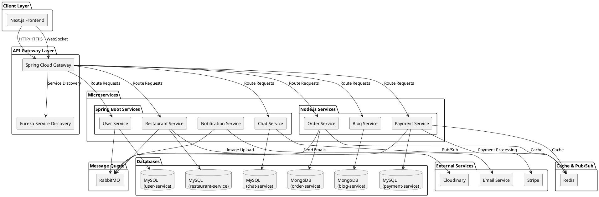

---

## CHƯƠNG 3: PHÂN TÍCH VÀ THIẾT KẾ HỆ THỐNG

### 3.1 Kiến trúc hệ thống

#### 3.1.1 Mô hình Client-Server với Microservices

Hệ thống sử dụng mô hình **Client-Server** với kiến trúc **Microservices**:

```
┌─────────────────────────────────────────────────────────────┐
│                        CLIENT LAYER                         │
│                    (Next.js Frontend)                       │
│  - React Components                                         │
│  - State Management (Zustand)                               │
│  - API Clients (Axios)                                      │
│  - WebSocket Client (STOMP)                                 │
└───────────────────────┬─────────────────────────────────────┘
                        │
                        │ HTTP/HTTPS
                        │ WebSocket (WS/WSS)
                        │
┌───────────────────────▼─────────────────────────────────────┐
│                    API GATEWAY LAYER                        │
│              (Spring Cloud Gateway)                         │
│  - Request Routing                                          │
│  - Authentication & Authorization                           │
│  - Load Balancing                                           │
│  - Rate Limiting                                            │
└───────────────────────┬─────────────────────────────────────┘
                        │
        ┌───────────────┼───────────────┐
        │               │               │
┌───────▼────┐   ┌──────▼────┐   ┌──────▼────┐
│   User     │   │Restaurant │   │  Order    │
│  Service   │   │  Service  │   │  Service  │
│ (Spring)   │   │ (Spring)  │   │ (Node.js) │
└──────┬─────┘   └─────┬─────┘   └─────┬─────┘
       │               │               │
       │               │               │
┌──────▼─────┐   ┌─────▼─────┐   ┌─────▼─────┐
│   MySQL    │   │   MySQL   │   │  MongoDB  │
│  Database  │   │  Database │   │  Database │
└────────────┘   └───────────┘   └───────────┘
```

**Component Diagram - PlantUML**:

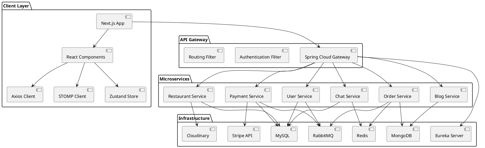

#### 3.1.2 Luồng hoạt động tổng quan

**Luồng đặt hàng (Order Flow)**:

1. **Người dùng tương tác trên giao diện Next.js**:
   - Tìm kiếm nhà hàng, xem menu, thêm món vào giỏ hàng
   - Next.js gọi API qua Axios đến API Gateway

2. **API Gateway nhận request**:
   - Validate JWT token từ cookie/header
   - Route request đến service tương ứng (restaurant-service, order-service)

3. **Backend Service xử lý**:
   - **restaurant-service**: Trả về danh sách nhà hàng, menu
   - **order-service**: Tạo đơn hàng, cập nhật giỏ hàng
   - Truy vấn database (MySQL/MongoDB) để lấy/cập nhật dữ liệu

4. **Response trả về**:
   - Service trả về JSON response
   - API Gateway forward response về Next.js
   - Next.js render dữ liệu và hiển thị cho người dùng

**Luồng thanh toán (Payment Flow)**:

1. User chọn phương thức thanh toán trên Next.js
2. Next.js gọi `payment-service` qua API Gateway
3. **payment-service**:
   - Nếu thanh toán bằng Stripe: Tạo payment intent, redirect đến Stripe Checkout
   - Nếu thanh toán bằng ví: Trừ tiền từ ví của user
4. Sau khi thanh toán thành công:
   - **payment-service** gửi message qua RabbitMQ đến `order-service`
   - **order-service** cập nhật trạng thái đơn hàng
   - **notification-service** gửi email xác nhận

**Luồng chat real-time (Chat Flow)**:

1. User mở trang chat trên Next.js
2. Next.js kết nối WebSocket đến API Gateway (`/ws`)
3. API Gateway forward WebSocket connection đến `chat-service`
4. **chat-service**:
   - Tạo STOMP connection
   - Subscribe vào topic `/topic/room/{roomId}`
5. Khi user gửi tin nhắn:
   - Next.js publish message qua STOMP đến `/app/chat.sendMessage`
   - **chat-service** lưu message vào database
   - **chat-service** publish message lên Redis channel
   - Redis subscriber forward message đến WebSocket topic
   - Tất cả clients subscribe topic đó nhận được message real-time

**Sơ đồ luồng hoạt động tổng quan - PlantUML**:

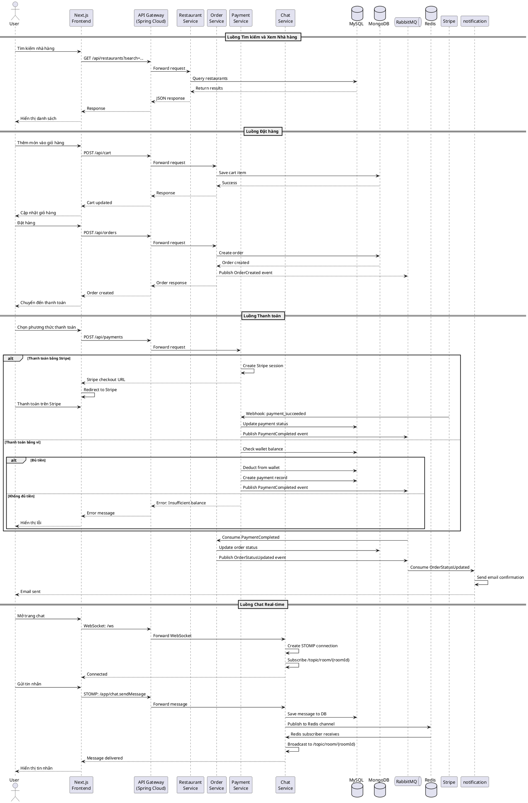

### 3.2 Mô tả các thành phần trong hệ thống

#### 3.2.1 Frontend (Next.js)

**Server-Side Rendering (SSR)**:
- Các trang công khai (danh sách nhà hàng, blog) được render trên server để tối ưu SEO và tốc độ tải trang ban đầu.
- Sử dụng `async function` trong Server Components để fetch data trước khi render.

**Client-Side Rendering (CSR)**:
- Các trang cần tương tác (dashboard, chat, cart) được render trên client để có trải nghiệm mượt mà.
- Sử dụng `"use client"` directive để đánh dấu Client Components.

**State Management**:
- **Zustand**: Quản lý global state (authentication, cart, restaurant data)
- **React Context**: Quản lý theme, notifications
- **Local State**: Sử dụng `useState`, `useReducer` cho component-level state

**API Communication**:
- **Axios**: HTTP client để gọi REST APIs
- **STOMP Client**: Kết nối WebSocket cho chat real-time
- **Interceptors**: Tự động thêm JWT token vào requests, handle errors

**Routing**:
- **App Router**: File-based routing với `app/` directory
- **Route Groups**: Tổ chức routes theo nhóm `(client)`, `(admin)`, `(auth)`
- **Dynamic Routes**: `[slug]`, `[id]` cho các trang chi tiết

#### 3.2.2 Backend Services

**API Gateway (Spring Cloud Gateway)**:
- **Routing**: Route requests đến service tương ứng dựa trên path và method
- **Authentication Filter**: Validate JWT token, extract user info
- **Authorization**: Kiểm tra role (USER, MERCHANT, ADMIN) trước khi forward request
- **Load Balancing**: Sử dụng Eureka để load balance giữa các service instances
- **CORS**: Cấu hình CORS để cho phép frontend gọi API

**User Service (Spring Boot)**:
- **Authentication**: Login, register, logout
- **JWT Management**: Tạo và validate JWT tokens
- **Email Verification**: Gửi email xác thực khi đăng ký
- **2FA**: Hỗ trợ Two-Factor Authentication với TOTP
- **OAuth2**: Tích hợp đăng nhập với Google
- **User Management**: CRUD operations cho users, addresses

**Restaurant Service (Spring Boot)**:
- **Restaurant Management**: CRUD operations cho restaurants
- **Product Management**: CRUD operations cho products (món ăn)
- **Category Management**: Quản lý danh mục món ăn
- **Review Management**: Lưu trữ và tính toán rating
- **Image Upload**: Tích hợp Cloudinary để upload và quản lý ảnh

**Order Service (Node.js)**:
- **Cart Management**: Thêm/sửa/xóa items trong giỏ hàng
- **Order Processing**: Tạo đơn hàng, cập nhật trạng thái
- **Group Orders**: Xử lý đặt nhóm, chia sẻ link, thanh toán riêng lẻ
- **Order History**: Lưu trữ lịch sử đơn hàng
- **RabbitMQ Consumer**: Nhận events từ payment-service để cập nhật order status

**Payment Service (Node.js)**:
- **Stripe Integration**: Xử lý thanh toán bằng thẻ tín dụng
- **Wallet Management**: Quản lý ví điện tử nội bộ
- **Payout Requests**: Merchant có thể yêu cầu rút tiền
- **Transaction History**: Lưu trữ lịch sử giao dịch
- **RabbitMQ Publisher**: Gửi events khi payment completed

**Chat Service (Spring Boot)**:
- **WebSocket/STOMP**: Xử lý kết nối WebSocket
- **Message Storage**: Lưu trữ tin nhắn vào MySQL
- **Room Management**: Tạo và quản lý chat rooms
- **Redis Integration**: Sử dụng Redis Pub/Sub để broadcast messages
- **Read Status**: Đánh dấu tin nhắn đã đọc

**Blog Service (Node.js)**:
- **Blog CRUD**: Tạo, đọc, cập nhật, xóa blog posts
- **Comments**: Quản lý comments trên blog
- **Likes**: Hệ thống like/unlike blog posts
- **Search**: Full-text search trong blog content
- **MongoDB**: Lưu trữ blog data với flexible schema

**Notification Service (Spring Boot)**:
- **Email Sending**: Gửi email thông báo (đăng ký thành công, đơn hàng, merchant approval)
- **Template Engine**: Sử dụng Thymeleaf để render email templates
- **RabbitMQ Consumer**: Nhận events từ các services khác để gửi email
- **Email Types**: 
  - Verification email khi đăng ký
  - Welcome email sau khi verify
  - Order confirmation email
  - Order status update email
  - Merchant approval/rejection email
  - Password reset email

#### 3.2.3 Các tính năng chi tiết

**1. Quản lý Giỏ hàng (Cart Management)**:
- **Thêm món vào giỏ**: User chọn món, size, số lượng → Lưu vào MongoDB
- **Cập nhật giỏ hàng**: Thay đổi số lượng, xóa món
- **Lưu giỏ hàng**: Giỏ hàng được lưu theo userId, persist giữa các sessions
- **Validation**: Kiểm tra món còn available, giá có thay đổi không
- **Tính tổng tiền**: Tự động tính tổng dựa trên giá và số lượng

**2. Group Order (Đặt nhóm)**:
- **Tạo group order**: User tạo group order, hệ thống generate unique token
- **Chia sẻ link**: Link có dạng `/group-orders/{token}`
- **Thêm món chung**: Nhiều người có thể thêm món vào cùng một group order
- **Thanh toán riêng lẻ**: Mỗi người thanh toán phần của mình
- **Thanh toán tất cả**: Chủ đơn có thể thanh toán toàn bộ
- **Theo dõi trạng thái**: Xem ai đã thanh toán, ai chưa
- **Tự động đóng**: Group order tự động đóng sau khi tất cả đã thanh toán

**3. Hệ thống Đánh giá (Review System)**:
- **Đánh giá nhà hàng**: User có thể đánh giá sau khi đặt hàng
- **Đánh giá món ăn**: Đánh giá từng món đã đặt
- **Rating**: 1-5 sao với comment
- **Tính toán rating trung bình**: Tự động cập nhật rating của nhà hàng/món ăn
- **Hiển thị reviews**: Pagination, filter theo rating, sort theo thời gian
- **Validation**: Chỉ đánh giá được sau khi đã nhận hàng

**4. Blog System**:
- **Tạo blog**: Admin/Merchant có thể tạo blog posts
- **Categories**: Phân loại blog (recipe, review, tips, news, health, other)
- **Rich Content**: Hỗ trợ HTML content, images
- **Comments**: User có thể comment trên blog
- **Likes**: Hệ thống like/unlike blog posts
- **Views**: Đếm số lượt xem
- **Search**: Full-text search trong title và content
- **Popular Posts**: Hiển thị bài viết nổi bật theo lượt xem

**5. Quản lý Địa chỉ (Address Management)**:
- **Thêm địa chỉ**: User có thể thêm nhiều địa chỉ giao hàng
- **Map Integration**: Chọn vị trí trên map, tự động lấy tọa độ
- **Geolocation API**: Lấy vị trí hiện tại tự động
- **Địa chỉ mặc định**: Set một địa chỉ làm mặc định
- **Validation**: Kiểm tra địa chỉ hợp lệ

**6. Wallet System (Ví điện tử)**:
- **Tạo wallet**: Tự động tạo wallet khi user đăng ký
- **Nạp tiền**: User có thể nạp tiền vào ví (chưa implement payment gateway cho nạp tiền)
- **Thanh toán bằng ví**: Trừ tiền từ ví khi đặt hàng
- **Lịch sử giao dịch**: Xem tất cả transactions (deposit, withdrawal, payment, refund)
- **Payout Requests**: Merchant có thể yêu cầu rút tiền từ ví
- **Admin Approval**: Admin phê duyệt payout requests

**7. Merchant Dashboard**:
- **Thống kê tổng quan**: Doanh thu, số đơn hàng, rating trung bình
- **Charts**: Biểu đồ doanh thu theo ngày/tuần/tháng
- **Top Products**: Món bán chạy nhất
- **Order Management**: Xem, filter, cập nhật trạng thái đơn hàng
- **Product Management**: CRUD món ăn với upload ảnh
- **Staff Management**: Quản lý nhân viên (chưa implement đầy đủ)
- **Settings**: Cập nhật thông tin nhà hàng, giờ mở cửa

**8. Admin Dashboard**:
- **System Overview**: Tổng số users, merchants, orders, revenue
- **User Management**: Xem, enable/disable users
- **Merchant Approval**: Phê duyệt/từ chối merchant requests
- **Restaurant Management**: Xem, enable/disable restaurants
- **Category Management**: CRUD categories
- **Size Management**: CRUD sizes (S, M, L, XL)
- **Promotion Management**: Tạo và quản lý khuyến mãi (chưa implement đầy đủ)
- **Order Monitoring**: Xem tất cả orders trong hệ thống

**9. Authentication & Authorization**:
- **JWT Authentication**: Stateless authentication với JWT tokens
- **Role-based Access Control**: USER, MERCHANT, ADMIN
- **Email Verification**: Xác thực email khi đăng ký
- **2FA (Two-Factor Authentication)**: Hỗ trợ TOTP với Google Authenticator
- **OAuth2**: Đăng nhập với Google
- **Password Reset**: Reset mật khẩu qua email
- **Session Management**: Refresh tokens để renew access tokens

**10. Image Management**:
- **Cloudinary Integration**: Upload và lưu trữ ảnh trên Cloudinary
- **Image Optimization**: Tự động optimize ảnh (resize, format conversion)
- **CDN**: Phân phối ảnh qua CDN toàn cầu
- **Delete Images**: Xóa ảnh trên Cloudinary khi xóa entity
- **Image Types**: 
  - Restaurant images
  - Product images
  - Blog featured images
  - User avatars (chưa implement)

**11. Search & Filter**:
- **Restaurant Search**: Tìm kiếm theo tên, địa chỉ
- **Filter**: Theo category, rating, khoảng cách
- **Sort**: Theo rating, distance, newest
- **Pagination**: Phân trang kết quả
- **Geolocation Search**: Tìm nhà hàng gần vị trí hiện tại

**12. Order Tracking**:
- **Order Status**: pending → preparing → delivering → completed
- **Real-time Updates**: Cập nhật trạng thái real-time (qua WebSocket hoặc polling)
- **Timeline**: Hiển thị timeline các bước của đơn hàng
- **Delivery Tracking**: Theo dõi đơn hàng đang giao (chưa có map real-time)

### 3.3 Phân tích các Actor và Use Case

#### 3.3.1 Các Actor trong hệ thống

1. **User (Khách hàng)**:
   - Đăng ký, đăng nhập
   - Tìm kiếm nhà hàng và món ăn
   - Xem chi tiết nhà hàng và món ăn
   - Thêm món vào giỏ hàng
   - Đặt hàng và thanh toán
   - Theo dõi trạng thái đơn hàng
   - Chat với merchant
   - Đánh giá nhà hàng và món ăn
   - Quản lý địa chỉ giao hàng
   - Xem blog và comment

2. **Merchant (Chủ nhà hàng)**:
   - Đăng ký tài khoản merchant (chờ admin phê duyệt)
   - Quản lý thông tin nhà hàng (cập nhật địa chỉ, giờ mở cửa, ảnh)
   - Quản lý menu (thêm/sửa/xóa món ăn, upload ảnh, set giá theo size)
   - Quản lý categories của nhà hàng
   - Xem và xử lý đơn hàng (cập nhật trạng thái: preparing, delivering, completed)
   - Chat với khách hàng real-time
   - Xem báo cáo doanh thu (theo ngày/tuần/tháng)
   - Xem thống kê món bán chạy
   - Quản lý ví điện tử và yêu cầu rút tiền
   - Quản lý nhân viên (chưa implement đầy đủ)
   - Xem reviews và rating của nhà hàng

3. **Admin (Quản trị viên)**:
   - Quản lý users (xem danh sách, chi tiết, enable/disable tài khoản)
   - Phê duyệt/từ chối yêu cầu merchant (xem thông tin nhà hàng, approve/reject)
   - Quản lý merchants (xem danh sách, enable/disable)
   - Quản lý restaurants (xem tất cả nhà hàng, enable/disable, xem chi tiết)
   - Quản lý categories (CRUD operations)
   - Quản lý sizes (CRUD operations: S, M, L, XL)
   - Quản lý promotions (tạo, sửa, xóa khuyến mãi - chưa implement đầy đủ)
   - Xem tất cả đơn hàng (filter, search, xem chi tiết)
   - Xem dashboard với thống kê tổng quan (users, merchants, orders, revenue)
   - Quản lý payout requests từ merchants
   - Xem system logs và monitoring (chưa implement)

#### 3.3.2 Sơ đồ Use Case tổng quát

```
                    ┌─────────────────┐
                    │      User       │
                    └────────┬────────┘
                             │
        ┌────────────────────┼────────────────────┐
        │                    │                    │
   ┌────▼────┐         ┌─────▼─────┐        ┌────▼────┐
   │ Tìm kiếm│         │ Đặt hàng  │        │  Chat   │
   │ nhà hàng│         │ & Thanh   │        │         │
   │         │         │   toán    │        │         │
   └─────────┘         └───────────┘        └─────────┘

                    ┌─────────────────┐
                    │    Merchant      │
                    └────────┬────────┘
                             │
        ┌────────────────────┼────────────────────┐
        │                    │                    │
   ┌────▼────┐         ┌─────▼─────┐        ┌────▼────┐
   │ Quản lý │         │ Quản lý   │        │ Xem báo │
   │ nhà hàng│         │ đơn hàng  │        │  cáo    │
   └─────────┘         └───────────┘        └─────────┘

                    ┌─────────────────┐
                    │      Admin      │
                    └────────┬────────┘
                             │
        ┌────────────────────┼────────────────────┐
        │                    │                    │
   ┌────▼────┐         ┌─────▼─────┐        ┌────▼────┐
   │ Quản lý │         │ Phê duyệt │        │ Dashboard│
   │  users  │         │ merchant  │        │          │
   └─────────┘         └───────────┘        └─────────┘
```

#### 3.3.3 Use Case chi tiết: Đặt hàng và thanh toán

**Actor**: User

**Preconditions**: User đã đăng nhập, có items trong giỏ hàng

**Main Flow**:
1. User xem giỏ hàng
2. User chọn địa chỉ giao hàng
3. User chọn phương thức thanh toán (tiền mặt/thẻ/ví)
4. User xác nhận đặt hàng
5. Hệ thống tạo đơn hàng
6. Nếu thanh toán bằng thẻ:
   - Hệ thống redirect đến Stripe Checkout
   - User thanh toán trên Stripe
   - Stripe gửi webhook về payment-service
7. Nếu thanh toán bằng ví:
   - Hệ thống trừ tiền từ ví của user
8. payment-service gửi event qua RabbitMQ
9. order-service cập nhật trạng thái đơn hàng
10. notification-service gửi email xác nhận
11. Hệ thống hiển thị thông báo thành công

**Alternative Flows**:
- 3a. Ví không đủ tiền: Hiển thị thông báo lỗi, yêu cầu nạp tiền
- 6a. Thanh toán Stripe thất bại: Hiển thị thông báo lỗi, giữ nguyên giỏ hàng

**Postconditions**: Đơn hàng được tạo, trạng thái là "pending" hoặc "paid"

#### 3.3.4 Use Case chi tiết: Chat real-time

**Actor**: User, Merchant

**Preconditions**: User và Merchant đã đăng nhập

**Main Flow**:
1. User mở trang chat
2. Hệ thống load danh sách conversations
3. User chọn một conversation hoặc tạo mới
4. Hệ thống kết nối WebSocket
5. Hệ thống load tin nhắn cũ (pagination)
6. User nhập và gửi tin nhắn
7. Frontend publish message qua STOMP
8. chat-service nhận message, lưu vào database
9. chat-service publish message lên Redis
10. Redis subscriber broadcast đến WebSocket clients
11. Merchant nhận tin nhắn real-time
12. Merchant trả lời (tương tự bước 6-11)
13. User nhận tin nhắn real-time

**Alternative Flows**:
- 4a. WebSocket connection failed: Retry với exponential backoff
- 8a. Database error: Log error, nhưng vẫn broadcast message

**Postconditions**: Tin nhắn được lưu trữ, cả hai bên nhận được message

### 3.4 Sơ đồ hoạt động (Activity Diagram)

#### 3.4.1 Luồng đặt hàng

```
[Start] → [User xem giỏ hàng] → [Chọn địa chỉ giao hàng]
    ↓
[Chọn phương thức thanh toán]
    ↓
    ├─→ [Tiền mặt] → [Tạo đơn hàng] → [Thành công]
    │
    ├─→ [Thẻ tín dụng] → [Redirect Stripe] → [User thanh toán]
    │                                           ↓
    │                                    [Stripe webhook]
    │                                           ↓
    │                                    [Cập nhật đơn hàng]
    │                                           ↓
    │                                    [Thành công]
    │
    └─→ [Ví điện tử] → [Kiểm tra số dư]
                           ↓
                    [Đủ tiền?]
                    ├─ Yes → [Trừ tiền] → [Tạo đơn hàng] → [Thành công]
                    └─ No → [Hiển thị lỗi] → [End]
```

**Activity Diagram - Luồng đặt hàng - PlantUML**:

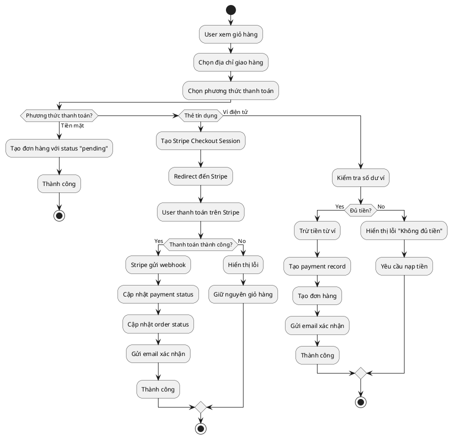

#### 3.4.2 Luồng chat real-time

```
[Start] → [User mở trang chat] → [Load conversations]
    ↓
[Chọn conversation] → [Kết nối WebSocket]
    ↓
[Subscribe topic] → [Load tin nhắn cũ]
    ↓
[Hiển thị chat window]
    ↓
[User nhập tin nhắn] → [Gửi qua STOMP]
    ↓
[chat-service nhận] → [Lưu vào DB]
    ↓
[Publish lên Redis] → [Broadcast đến clients]
    ↓
[Merchant nhận tin nhắn] → [Hiển thị]
    ↓
[Merchant trả lời] → [Tương tự flow trên]
    ↓
[User nhận tin nhắn] → [End]
```

**Activity Diagram - Luồng chat real-time - PlantUML**:

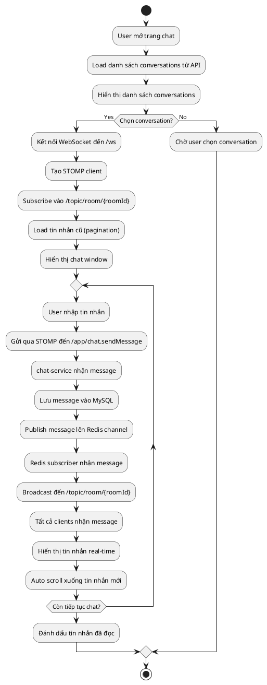

#### 3.4.3 Luồng đăng ký Merchant

**Activity Diagram - Đăng ký Merchant - PlantUML**:

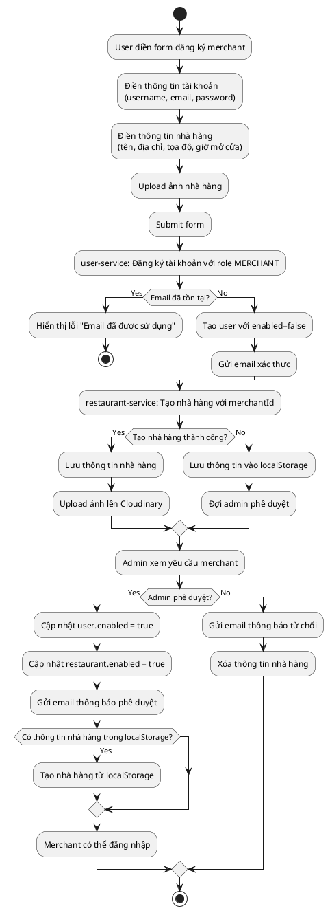

#### 3.4.4 Luồng Group Order

**Activity Diagram - Group Order - PlantUML**:

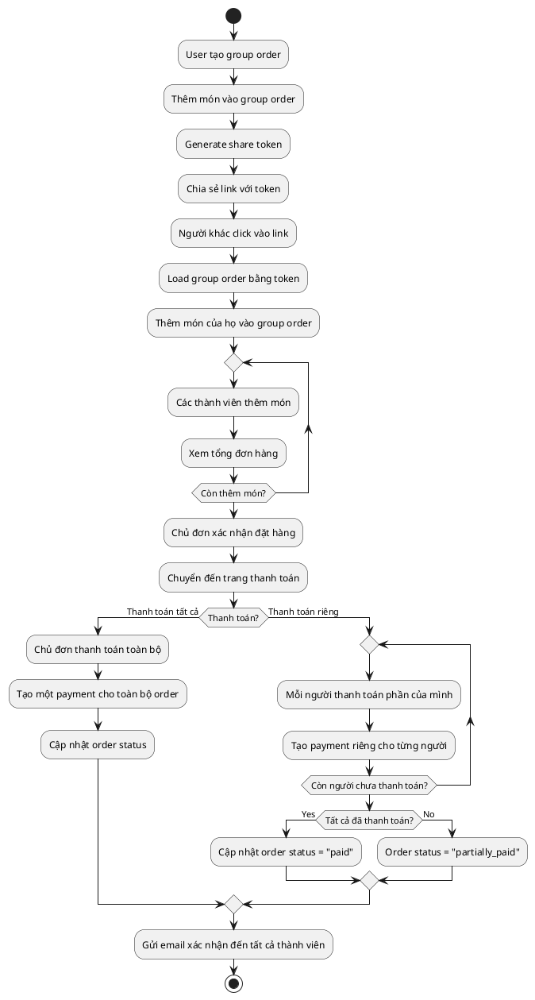

### 3.5 Sequence Diagrams (Sơ đồ trình tự)

#### 3.5.1 Sequence Diagram - Đặt hàng và Thanh toán

**Sequence Diagram - PlantUML**:

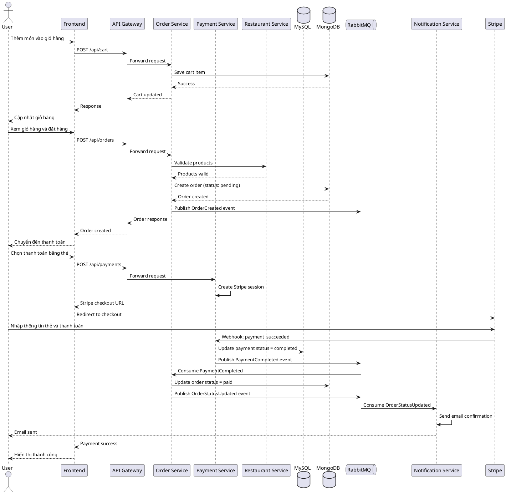

#### 3.5.2 Sequence Diagram - Chat Real-time

**Sequence Diagram - PlantUML**:

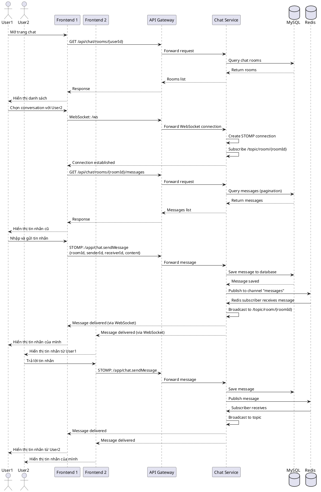

#### 3.5.3 Sequence Diagram - Đăng ký và Phê duyệt Merchant

**Sequence Diagram - PlantUML**:

```plantuml
@startuml Sequence - Đăng ký Merchant
actor User
participant Frontend
participant "API Gateway" as Gateway
participant "User Service" as UserService
participant "Restaurant Service" as RestaurantService
participant "Notification Service" as NotificationService
participant Admin
database MySQL
queue RabbitMQ

User -> Frontend: Điền form đăng ký merchant
User -> Frontend: Submit form với thông tin\nuser + restaurant
Frontend -> Gateway: POST /api/users/register\n{username, email, password, role: MERCHANT}
Gateway -> UserService: Forward request
UserService -> MySQL: Check email exists
alt Email đã tồn tại
    MySQL --> UserService: Email exists
    UserService --> Gateway: Error: Email already exists
    Gateway --> Frontend: Error response
    Frontend --> User: Hiển thị lỗi
else Email chưa tồn tại
    MySQL --> UserService: Email not found
    UserService -> MySQL: Create user (enabled=false)
    MySQL --> UserService: User created
    UserService -> RabbitMQ: Publish UserRegistered event
    RabbitMQ -> NotificationService: Consume event
    NotificationService -> NotificationService: Send verification email
    NotificationService --> User: Email sent
    UserService --> Gateway: User created
    Gateway --> Frontend: Success response
    
    Frontend -> Gateway: POST /api/restaurants\n{restaurant info, merchantId}
    Gateway -> RestaurantService: Forward request
    RestaurantService -> MySQL: Create restaurant (enabled=false)
    MySQL --> RestaurantService: Restaurant created
    RestaurantService -> RestaurantService: Upload image to Cloudinary
    RestaurantService --> Gateway: Restaurant created
    Gateway --> Frontend: Success
    Frontend --> User: Thông báo "Chờ admin phê duyệt"
endif

Admin -> Frontend: Xem danh sách merchant requests
Frontend -> Gateway: GET /api/admin/merchant-requests
Gateway -> UserService: Forward request
UserService -> MySQL: Query users with role MERCHANT and enabled=false
MySQL --> UserService: Return pending merchants
UserService --> Gateway: Pending merchants list
Gateway --> Frontend: Response
Frontend --> Admin: Hiển thị danh sách

Admin -> Frontend: Phê duyệt merchant
Frontend -> Gateway: PUT /api/admin/merchants/{userId}/approve
Gateway -> UserService: Forward request
UserService -> MySQL: Update user.enabled = true
MySQL --> UserService: Updated
UserService -> RabbitMQ: Publish MerchantApproved event
RabbitMQ -> NotificationService: Consume event
NotificationService -> NotificationService: Send approval email
NotificationService --> User: Email "Bạn đã được phê duyệt"
UserService -> RestaurantService: Update restaurant.enabled = true
RestaurantService -> MySQL: Update restaurant
MySQL --> RestaurantService: Updated
UserService --> Gateway: Merchant approved
Gateway --> Frontend: Success
Frontend --> Admin: Thông báo thành công

@enduml
```

### 3.6 Thiết kế dữ liệu

#### 3.6.1 Sơ đồ thực thể liên kết (ERD)

**Database: user-service**

```
┌─────────────┐
│    users    │
├─────────────┤
│ id (PK)     │
│ username    │
│ email (UK)  │
│ password    │
│ role        │
│ enabled     │
│ phone       │
│ slug (UK)   │
└──────┬──────┘
       │
       │ 1:N
       │
┌──────▼──────┐
│  address   │
├────────────┤
│ id (PK)    │
│ location   │
│ longitude  │
│ latitude   │
│ user_id(FK)│
└────────────┘
```

**Database: restaurant-service**

```
┌─────────────┐         ┌──────────────────┐         ┌─────────────┐
│ restaurants │         │restaurant_categories│       │ categories  │
├─────────────┤         ├──────────────────┤         ├─────────────┤
│ id (PK)     │◄───┐    │ restaurant_id(FK) │    ┌───│ id (PK)     │
│ res_name    │    │    │ category_id (FK)  │───┘    │ cate_name   │
│ address     │    │    └──────────────────┘        └─────────────┘
│ longitude   │    │
│ latitude    │    │
│ rating      │    │    ┌─────────────┐
│ opening_time│    │    │  products   │
│ closing_time│    │    ├─────────────┤
│ image_url   │    └───│ id (PK)     │
│ merchant_id │        │ product_name│
│ slug (UK)   │        │ description │
│ enabled     │        │ restaurant_id│
└─────────────┘        │ category_id │
                       │ image_url   │
                       │ rating      │
                       │ slug (UK)   │
                       │ available   │
                       └──────┬──────┘
                              │
                              │ 1:N
                              │
                       ┌──────▼──────────┐         ┌─────────────┐
                       │ product_sizes  │         │    size     │
                       ├────────────────┤         ├─────────────┤
                       │ id (PK)        │    ┌───│ id (PK)     │
                       │ product_id (FK)│───┘    │ name        │
                       │ size_id (FK)   │───┐    └─────────────┘
                       │ price          │   │
                       └────────────────┘   │
                                             │
                       ┌────────────────────┘
                       │
                       │
┌─────────────┐        │
│   reviews   │        │
├─────────────┤        │
│ id (PK)     │        │
│ title       │        │
│ content     │        │
│ rating      │        │
│ review_id   │        │
│ review_type │        │
│ user_id     │        │
└─────────────┘        │
```

**Database: chat-service**

```
┌──────────────┐         ┌─────────────┐
│  chat_rooms  │         │  messages   │
├──────────────┤         ├─────────────┤
│ id (PK)      │◄───┐    │ id (PK)     │
│ user1_id     │    │    │ sender_id   │
│ user2_id     │    └───│ receiver_id │
│ last_message │        │ content     │
│ last_msg_time│        │ room_id (FK)│
└──────────────┘        │ timestamp   │
                        │ is_read     │
                        └─────────────┘
```

**Database: payment-service**

```
┌─────────────┐         ┌──────────────────┐         ┌─────────────────┐
│  payments   │         │     wallets      │         │wallet_transactions│
├─────────────┤         ├──────────────────┤         ├─────────────────┤
│ id (PK)     │         │ id (PK)          │         │ id (PK)         │
│ paymentId   │         │ userId (UK)      │         │ wallet_id (FK)  │
│ orderId     │         │ balance          │         │ amount          │
│ userId      │         │ currency         │         │ type            │
│ amount      │         │ created_at       │         │ description     │
│ currency    │         │ updated_at       │         │ created_at      │
│ paymentMethod│        └──────────────────┘         └─────────────────┘
│ status      │
│ transactionId│
│ created_at  │
│ updated_at  │
└─────────────┘

┌─────────────────┐
│ payout_requests │
├─────────────────┤
│ id (PK)         │
│ merchant_id     │
│ amount          │
│ status          │
│ created_at      │
└─────────────────┘
```

#### 3.5.2 Mô tả các bảng dữ liệu chính

**Bảng `users`**:
- Lưu trữ thông tin người dùng (user, merchant, admin)
- `role`: USER, MERCHANT, ADMIN
- `enabled`: Tài khoản có được kích hoạt không
- `slug`: URL-friendly identifier

**Bảng `restaurants`**:
- Lưu trữ thông tin nhà hàng
- `merchant_id`: Foreign key đến `users.id`
- `rating`: Điểm đánh giá trung bình
- `enabled`: Nhà hàng có đang hoạt động không

**Bảng `products`**:
- Lưu trữ thông tin món ăn
- `restaurant_id`: Foreign key đến `restaurants.id`
- `category_id`: Foreign key đến `categories.id`
- `available`: Món có đang phục vụ không

**Bảng `product_sizes`**:
- Lưu trữ giá của món ăn theo từng size (S, M, L)
- `product_id`: Foreign key đến `products.id`
- `size_id`: Foreign key đến `size.id`
- `price`: Giá của món với size tương ứng

**Bảng `chat_rooms`**:
- Lưu trữ thông tin phòng chat giữa 2 users
- `user1_id`, `user2_id`: IDs của 2 người trong phòng chat
- `last_message`: Tin nhắn cuối cùng để hiển thị preview

**Bảng `messages`**:
- Lưu trữ từng tin nhắn trong chat
- `room_id`: Foreign key đến `chat_rooms.id`
- `is_read`: Đánh dấu tin nhắn đã đọc chưa

**Bảng `payments`**:
- Lưu trữ thông tin thanh toán
- `paymentMethod`: cash, card, wallet
- `status`: pending, processing, completed, failed, refunded
- `transactionId`: ID từ payment gateway (Stripe)

**Bảng `wallets`**:
- Lưu trữ ví điện tử của users
- `balance`: Số dư hiện tại
- Mỗi user có một wallet duy nhất

**Bảng `wallet_transactions`**:
- Lưu trữ lịch sử giao dịch của wallet
- `type`: deposit, withdrawal, payment, refund
- `amount`: Số tiền (có thể âm hoặc dương)

#### 3.6.2 ERD - PlantUML

**ERD cho user-service - PlantUML**:

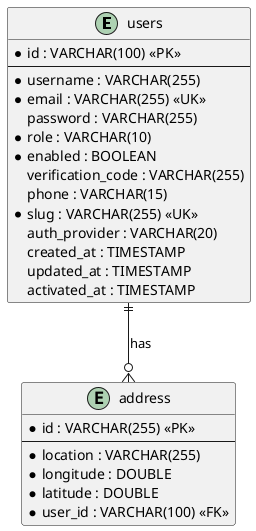

**ERD cho restaurant-service - PlantUML**:

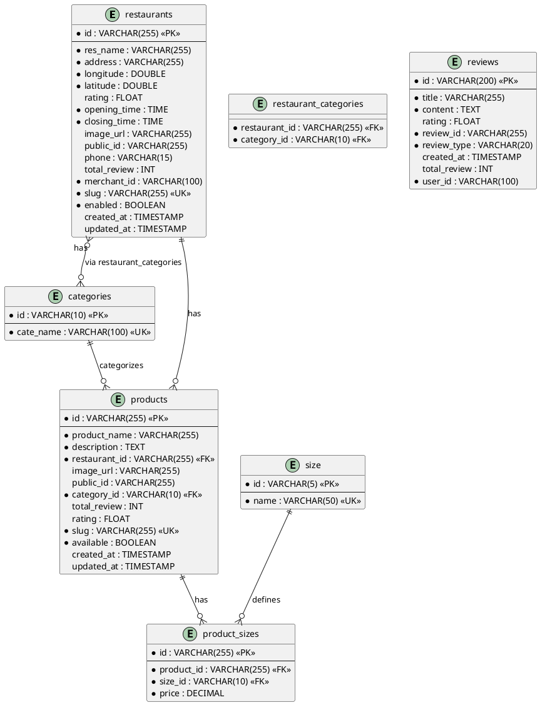

**ERD cho chat-service - PlantUML**:

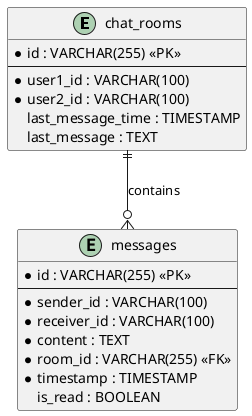

**ERD cho payment-service - PlantUML**:

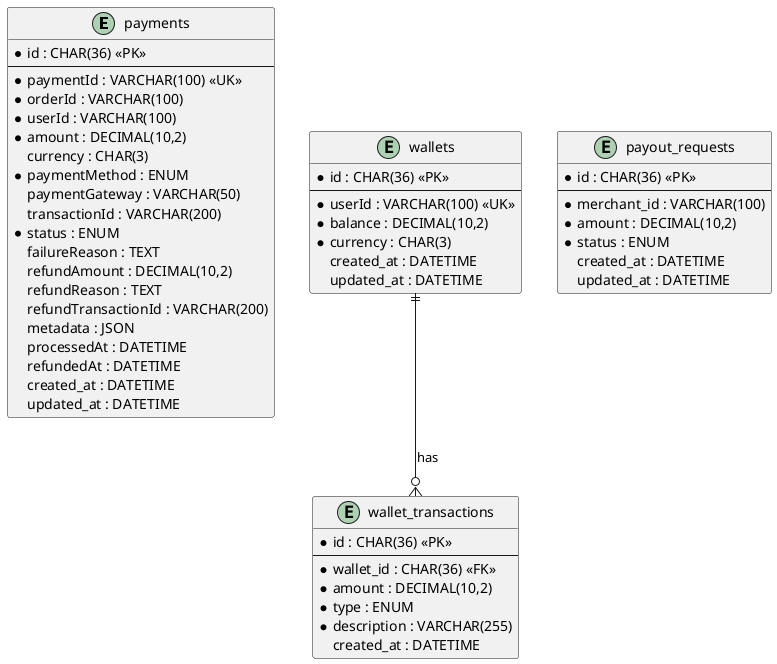

---

## CHƯƠNG 4: THIẾT KẾ MÀN HÌNH

### 4.1 Sơ đồ liên kết màn hình (User Flow)

```
                    ┌──────────────┐
                    │   Trang chủ  │
                    └──────┬───────┘
                           │
        ┌──────────────────┼──────────────────┐
        │                  │                  │
   ┌────▼────┐       ┌──────▼──────┐      ┌────▼────┐
   │ Đăng   │       │ Danh sách  │      │  Blog  │
   │ nhập   │       │  nhà hàng   │      │        │
   └────┬───┘       └──────┬──────┘      └────────┘
        │                  │
        │                  │
   ┌────▼────┐       ┌──────▼──────┐
   │ Đăng ký │       │ Chi tiết    │
   │         │       │ nhà hàng    │
   └────┬────┘       └──────┬───────┘
        │                  │
        │                  │
   ┌────▼────┐       ┌──────▼──────┐
   │ Dashboard│      │ Chi tiết    │
   │  User   │      │   món ăn    │
   └────┬────┘      └──────┬───────┘
        │                  │
        │                  │
   ┌────▼────┐       ┌──────▼──────┐
   │  Giỏ    │       │ Thêm vào    │
   │  hàng   │◄──────│ giỏ hàng    │
   └────┬────┘       └─────────────┘
        │
        │
   ┌────▼────┐
   │ Thanh   │
   │  toán   │
   └────┬────┘
        │
        │
   ┌────▼────┐
   │ Đơn     │
   │ hàng    │
   └────┬────┘
        │
        │
   ┌────▼────┐
   │ Theo   │
   │ dõi    │
   └────────┘

[MERCHANT FLOW]

   ┌──────────────┐
   │ Merchant     │
   │ Dashboard    │
   └──────┬───────┘
          │
   ┌──────┼──────┐
   │      │      │
┌──▼──┐ ┌─▼──┐ ┌─▼──┐
│Quản │ │Quản│ │Báo │
│lý   │ │lý  │ │cáo │
│nhà  │ │đơn │ │    │
│hàng │ │hàng│ │    │
└─────┘ └────┘ └────┘

[ADMIN FLOW]

   ┌──────────────┐
   │ Admin        │
   │ Dashboard    │
   └──────┬───────┘
          │
   ┌──────┼──────┐
   │      │      │
┌──▼──┐ ┌─▼──┐ ┌─▼──┐
│Quản │ │Phê │ │Quản│
│lý   │ │duyệt│ │lý │
│users│ │merch│ │nhà│
└─────┘ └────┘ └────┘
```

### 4.2 Danh sách các màn hình

#### 4.2.1 Màn hình Client (User)

1. **Trang chủ** (`/`)
   - Hero section với slider
   - Danh sách nhà hàng nổi bật
   - Features section
   - Reviews từ khách hàng
   - Newsletter subscription

2. **Danh sách nhà hàng** (`/restaurants`)
   - Filter sidebar (theo danh mục, khoảng cách, rating)
   - Grid/List view của restaurants
   - Search bar
   - Pagination

3. **Chi tiết nhà hàng** (`/restaurants/[slug]`)
   - Hero section với ảnh nhà hàng
   - Thông tin nhà hàng (địa chỉ, giờ mở cửa, rating)
   - Menu với các danh mục
   - Reviews section
   - Chat button

4. **Chi tiết món ăn** (`/food/[slug]`)
   - Ảnh món ăn
   - Tên, mô tả, giá theo size
   - Form chọn size và số lượng
   - Related products
   - Reviews

5. **Giỏ hàng** (`/cart`)
   - Danh sách items trong giỏ
   - Tổng tiền
   - Chọn địa chỉ giao hàng
   - Button "Thanh toán"

6. **Thanh toán** (`/payment`)
   - Thông tin đơn hàng
   - Chọn phương thức thanh toán (tiền mặt/thẻ/ví)
   - Form nhập thông tin (nếu cần)
   - Stripe card element (nếu chọn thẻ)
   - Button "Xác nhận đặt hàng"

7. **Theo dõi đơn hàng** (`/delivery/[id]`)
   - Trạng thái đơn hàng (pending, preparing, delivering, completed)
   - Timeline
   - Thông tin đơn hàng chi tiết
   - Map hiển thị vị trí (nếu có)

8. **Lịch sử đơn hàng** (`/orders`)
   - Danh sách đơn hàng đã đặt
   - Filter theo trạng thái
   - Pagination

9. **Chi tiết đơn hàng** (`/orders/[id]`)
   - Thông tin đơn hàng
   - Danh sách món đã đặt
   - Trạng thái thanh toán
   - Button "Đặt lại"

10. **Chat** (`/chat`)
    - Sidebar danh sách conversations
    - Chat window với tin nhắn
    - Input field để gửi tin nhắn
    - Real-time updates

11. **Tài khoản** (`/account`)
    - Profile information
    - Edit profile modal
    - Links đến orders, addresses, settings

12. **Địa chỉ** (`/account/addresses`)
    - Danh sách địa chỉ đã lưu
    - Form thêm/sửa địa chỉ
    - Map picker để chọn vị trí

13. **Cài đặt** (`/account/settings`)
    - Đổi mật khẩu
    - Cài đặt 2FA
    - Preferences

14. **Blog** (`/blog`)
    - Danh sách blog posts
    - Filter theo category
    - Search
    - Pagination

15. **Chi tiết blog** (`/blog/[slug]`)
    - Nội dung blog post
    - Comments section
    - Related blogs
    - Like button

16. **Đăng ký** (`/register`)
    - Form đăng ký (username, email, password)
    - Validation
    - Link đến đăng nhập

17. **Đăng nhập** (`/login`)
    - Form đăng nhập (email, password)
    - "Quên mật khẩu" link
    - OAuth buttons (Google)

18. **Xác thực email** (`/verify-email`)
    - Form nhập mã xác thực
    - Resend code button

19. **Đăng ký Merchant** (`/partnerRegister`)
    - Form đăng ký tài khoản merchant
    - Form thông tin nhà hàng
    - Upload ảnh nhà hàng

#### 4.2.2 Màn hình Merchant

1. **Dashboard** (`/merchant`)
   - Thống kê tổng quan (doanh thu, đơn hàng, rating)
   - Charts và graphs
   - Recent orders

2. **Quản lý món ăn** (`/merchant/food`)
   - Danh sách món ăn
   - Search và filter
   - Button "Thêm món mới"
   - Edit/Delete actions

3. **Thêm/Sửa món ăn** (`/merchant/food/new`, `/merchant/food/[id]`)
   - Form nhập thông tin món
   - Upload ảnh
   - Quản lý sizes và giá
   - Select category

4. **Quản lý đơn hàng** (`/merchant/orders`)
   - Danh sách đơn hàng
   - Filter theo trạng thái
   - Update order status
   - Order details modal

5. **Báo cáo** (`/merchant/reports`)
   - Doanh thu theo ngày/tuần/tháng
   - Top selling products
   - Charts visualization

6. **Ví điện tử** (`/merchant/wallet`)
   - Số dư hiện tại
   - Lịch sử giao dịch
   - Form yêu cầu rút tiền

7. **Quản lý nhân viên** (`/merchant/manage/staff`)
   - Danh sách nhân viên
   - Thêm/sửa/xóa nhân viên

8. **Cài đặt** (`/merchant/manage/settings`)
   - Cập nhật thông tin nhà hàng
   - Upload ảnh
   - Cài đặt giờ mở cửa

#### 4.2.3 Màn hình Admin

1. **Dashboard** (`/admin/dashboard`)
   - Tổng quan hệ thống
   - Thống kê users, merchants, orders
   - Charts

2. **Quản lý Users** (`/admin/users`)
   - Danh sách users
   - Search và filter
   - Enable/Disable account
   - View details

3. **Quản lý Merchants** (`/admin/merchants`)
   - Danh sách merchants
   - Enable/Disable merchant
   - View restaurant details

4. **Yêu cầu Merchant** (`/admin/merchant-requests`)
   - Danh sách yêu cầu chờ phê duyệt
   - Approve/Reject actions
   - View request details

5. **Quản lý Nhà hàng** (`/admin/restaurants`)
   - Danh sách tất cả nhà hàng
   - Enable/Disable
   - View details

6. **Quản lý Categories** (`/admin/categories`)
   - Danh sách categories
   - CRUD operations

7. **Quản lý Sizes** (`/admin/sizes`)
   - Danh sách sizes (S, M, L, XL)
   - CRUD operations

8. **Quản lý Promotions** (`/admin/promotions`)
   - Danh sách khuyến mãi
   - Create/Edit/Delete promotions

9. **Quản lý Đơn hàng** (`/admin/order`)
   - Xem tất cả đơn hàng
   - Filter và search
   - Update status

10. **Cài đặt** (`/admin/settings`)
    - System settings
    - Configuration

### 4.3 Mô tả các màn hình

#### 4.3.1 Trang chủ (`/`)

**Các thành phần chính**:
- **Header**: Logo, navigation menu, search bar, cart icon, user menu
- **Hero Section**: Slider với các hình ảnh nhà hàng nổi bật, call-to-action buttons
- **Features Section**: Giới thiệu các tính năng chính (đặt món nhanh, thanh toán an toàn, giao hàng tận nơi)
- **Restaurants Section**: Hiển thị danh sách nhà hàng nổi bật với rating và ảnh
- **Reviews Section**: Hiển thị một số reviews từ khách hàng
- **Newsletter Section**: Form đăng ký nhận tin tức
- **Footer**: Links, thông tin liên hệ, social media

**Chức năng các nút**:
- "Xem thêm" → Navigate đến `/restaurants`
- "Đặt món ngay" → Navigate đến `/restaurants`
- Restaurant cards → Navigate đến `/restaurants/[slug]`

#### 4.3.2 Chi tiết nhà hàng (`/restaurants/[slug]`)

**Các thành phần chính**:
- **Hero Section**: Ảnh cover nhà hàng, tên, rating, địa chỉ
- **Restaurant Info**: Giờ mở cửa, số điện thoại, địa chỉ trên map
- **Actions Bar**: Button "Chat với nhà hàng", "Chia sẻ"
- **Navigation Tabs**: Menu, Reviews, About
- **Menu Section**: 
  - Categories sidebar
  - Grid của các món ăn với ảnh, tên, giá
  - Click vào món → Navigate đến `/food/[slug]`
- **Reviews Section**: 
  - Danh sách reviews với rating, comment
  - Form để thêm review (nếu đã đặt hàng)

**Chức năng các nút**:
- "Chat với nhà hàng" → Mở chat window hoặc navigate đến `/chat`
- Món ăn card → Navigate đến `/food/[slug]`
- "Thêm vào giỏ" → Thêm món vào cart (cần chọn size trước)

#### 4.3.3 Giỏ hàng (`/cart`)

**Các thành phần chính**:
- **Cart Items List**: 
  - Mỗi item hiển thị: ảnh, tên, size, giá, số lượng
  - Button tăng/giảm số lượng
  - Button xóa item
- **Delivery Address Section**:
  - Dropdown chọn địa chỉ đã lưu
  - Button "Thêm địa chỉ mới" → Navigate đến `/account/addresses`
- **Order Summary**:
  - Tổng tiền món ăn
  - Phí giao hàng
  - Tổng cộng
- **Action Buttons**:
  - "Tiếp tục mua sắm" → Navigate đến `/restaurants`
  - "Thanh toán" → Navigate đến `/payment`

**Chức năng**:
- Real-time update tổng tiền khi thay đổi số lượng
- Validation: Phải chọn địa chỉ giao hàng trước khi thanh toán

#### 4.3.4 Thanh toán (`/payment`)

**Các thành phần chính**:
- **Progress Indicator**: Hiển thị các bước (Giỏ hàng → Thanh toán → Hoàn tất)
- **Order Summary**: Tóm tắt đơn hàng (items, tổng tiền)
- **Payment Method Selection**:
  - Radio buttons: Tiền mặt, Thẻ tín dụng, Ví điện tử
  - Nếu chọn thẻ: Hiển thị Stripe card element
  - Nếu chọn ví: Hiển thị số dư và form xác nhận
- **Delivery Info**: Địa chỉ giao hàng, ghi chú
- **Action Buttons**:
  - "Quay lại" → Navigate đến `/cart`
  - "Xác nhận đặt hàng" → Submit payment

**Chức năng**:
- Validation payment method
- Nếu ví không đủ tiền: Hiển thị thông báo, yêu cầu nạp tiền
- Sau khi thanh toán thành công: Navigate đến `/delivery/[orderId]`

#### 4.3.5 Chat (`/chat`)

**Các thành phần chính**:
- **Sidebar (ChatList)**:
  - Danh sách conversations
  - Mỗi conversation hiển thị: avatar, tên, tin nhắn cuối, thời gian
  - Badge số tin nhắn chưa đọc (nếu có)
- **Chat Window**:
  - Header: Tên người đang chat
  - Messages area: 
    - Tin nhắn của mình (align right)
    - Tin nhắn của đối phương (align left)
    - Timestamp cho mỗi tin nhắn
  - Input area:
    - Text input
    - Button "Gửi"
    - Emoji picker (optional)

**Chức năng**:
- Real-time message updates qua WebSocket
- Auto scroll xuống tin nhắn mới nhất
- Mark as read khi mở conversation
- Pagination khi load tin nhắn cũ (scroll up)

#### 4.3.6 Merchant Dashboard (`/merchant`)

**Các thành phần chính**:
- **Stats Cards**:
  - Tổng doanh thu (hôm nay/tuần/tháng)
  - Số đơn hàng
  - Rating trung bình
  - Số món đang bán
- **Charts Section**:
  - Doanh thu theo ngày (line chart)
  - Top selling products (bar chart)
  - Orders theo trạng thái (pie chart)
- **Recent Orders Table**:
  - Danh sách đơn hàng gần đây
  - Trạng thái, tổng tiền
  - Link đến chi tiết

**Chức năng các nút**:
- "Xem tất cả đơn hàng" → Navigate đến `/merchant/orders`
- "Thêm món mới" → Navigate đến `/merchant/food/new`
- Order row → Navigate đến order details

#### 4.3.7 Admin Dashboard (`/admin/dashboard`)

**Các thành phần chính**:
- **Overview Stats**:
  - Tổng số users
  - Tổng số merchants
  - Tổng số orders
  - Tổng doanh thu
- **Charts**:
  - Users growth (line chart)
  - Orders theo ngày
  - Top restaurants by revenue
- **Recent Activities**:
  - Danh sách các hoạt động gần đây (user đăng ký, merchant approval, etc.)

**Chức năng**:
- Filter theo thời gian (ngày/tuần/tháng/năm)
- Export reports (CSV/PDF)

---

## CHƯƠNG 5: KẾT LUẬN

### 5.1 Kết luận

#### 5.1.1 Ưu điểm

**Đã hoàn thành các mục tiêu đề ra**:

1. **Hệ thống quản lý nhà hàng và menu hoàn chỉnh**:
   - Merchant có thể đăng ký, quản lý thông tin nhà hàng, thêm/sửa/xóa món ăn với nhiều size và giá khác nhau
   - Hệ thống hỗ trợ upload ảnh lên Cloudinary, phân loại món theo danh mục
   - Admin có thể phê duyệt merchant requests và quản lý toàn bộ nhà hàng

2. **Hệ thống đặt món và thanh toán trực tuyến**:
   - Khách hàng có thể tìm kiếm nhà hàng, xem menu, thêm vào giỏ hàng và đặt hàng
   - Hỗ trợ nhiều phương thức thanh toán: tiền mặt, thẻ tín dụng (Stripe), ví điện tử nội bộ
   - Tính năng Group Order cho phép nhiều người cùng đặt chung một đơn hàng
   - Hệ thống theo dõi đơn hàng real-time với các trạng thái rõ ràng

3. **Hệ thống chat real-time**:
   - Chat giữa user và merchant sử dụng WebSocket/STOMP
   - Lưu trữ lịch sử chat, hỗ trợ pagination
   - Đánh dấu tin nhắn đã đọc
   - Real-time message delivery

**Hệ thống chạy tốt ở các điểm**:

- **Performance**: 
  - SSR của Next.js giúp trang tải nhanh, SEO tốt
  - Redis caching giảm load database
  - Image optimization tự động

- **Scalability**:
  - Microservices architecture cho phép scale từng service độc lập
  - Load balancing qua Eureka
  - Database có thể scale riêng biệt

- **User Experience**:
  - UI/UX hiện đại, responsive trên mọi thiết bị
  - Real-time updates (chat, order status)
  - Error handling và validation tốt

- **Security**:
  - JWT authentication
  - Role-based access control
  - Input validation và sanitization
  - Secure payment với Stripe

- **Maintainability**:
  - Code được tổ chức rõ ràng, dễ đọc
  - Separation of concerns
  - API documentation với Swagger

#### 5.1.2 Hạn chế

**Những điểm chưa kịp làm hoặc chưa tối ưu**:

1. **Mobile Application**:
   - Hiện tại chỉ có web application, chưa có mobile app (iOS/Android)
   - Responsive design tốt nhưng không thể thay thế native app experience

2. **Tích hợp dịch vụ giao hàng**:
   - Chưa tích hợp với các dịch vụ giao hàng bên thứ ba (Grab, Gojek)
   - Tracking đơn hàng chỉ hiển thị trạng thái, chưa có map real-time

3. **Tính năng đề xuất**:
   - Chưa có hệ thống AI/ML để đề xuất món ăn dựa trên lịch sử đặt hàng
   - Chưa có personalized recommendations

4. **Tối ưu hóa**:
   - Chưa implement CDN cho static assets
   - Chưa có service worker cho offline support
   - Image lazy loading chưa được áp dụng đầy đủ

5. **Testing**:
   - Chưa có unit tests và integration tests đầy đủ
   - Chưa có E2E tests với Cypress/Playwright

6. **Monitoring và Logging**:
   - Chưa tích hợp đầy đủ monitoring tools (Prometheus, Grafana)
   - Logging chưa centralized (chưa dùng ELK stack)

7. **Internationalization**:
   - Chỉ hỗ trợ tiếng Việt, chưa có đa ngôn ngữ

8. **Advanced Features**:
   - Chưa có tính năng đặt bàn (reservation)
   - Chưa có loyalty program (tích điểm)
   - Chưa có voucher/coupon system đầy đủ

### 5.2 Hướng phát triển

**Dự kiến nâng cấp tính năng trong tương lai**:

1. **Mobile Applications**:
   - Phát triển ứng dụng iOS và Android sử dụng React Native hoặc Flutter
   - Push notifications cho mobile
   - Native features (camera để scan QR code, location services)

2. **Tích hợp AI và Machine Learning**:
   - Hệ thống đề xuất món ăn dựa trên lịch sử đặt hàng và preferences
   - Chatbot tự động trả lời câu hỏi thường gặp
   - Sentiment analysis cho reviews để cải thiện chất lượng dịch vụ
   - Dự đoán nhu cầu đặt hàng để merchant chuẩn bị nguyên liệu

3. **Tích hợp dịch vụ giao hàng**:
   - Tích hợp API của Grab, Gojek để tự động gọi shipper
   - Real-time tracking trên map với GPS
   - Tính toán phí giao hàng động dựa trên khoảng cách

4. **Hệ thống khuyến mãi và loyalty**:
   - Loyalty program với tích điểm và đổi quà
   - Voucher system với các loại giảm giá khác nhau
   - Flash sales và limited-time offers
   - Referral program (mời bạn được thưởng)

5. **Nâng cấp thanh toán**:
   - Tích hợp thêm các payment gateways (VNPay, Momo, ZaloPay)
   - Buy now, pay later (trả góp)
   - Subscription model cho merchant (gói premium)

6. **Analytics và Business Intelligence**:
   - Dashboard analytics chi tiết cho merchant
   - Predictive analytics cho inventory management
   - Customer segmentation và marketing campaigns
   - A/B testing cho UI/UX improvements

7. **Cải thiện trải nghiệm người dùng**:
   - Voice search để tìm kiếm món ăn
   - AR preview món ăn (khi có camera)
   - Video reviews từ khách hàng
   - Social sharing và reviews trên mạng xã hội

8. **Tối ưu hóa kỹ thuật**:
   - Implement CDN cho global distribution
   - Service workers cho offline support
   - GraphQL API để giảm over-fetching
   - Microservices communication với gRPC

9. **Bảo mật nâng cao**:
   - Rate limiting chi tiết hơn
   - DDoS protection
   - Security audit và penetration testing
   - Compliance với PCI DSS cho payment

10. **Mở rộng quốc tế**:
    - Đa ngôn ngữ (i18n)
    - Đa tiền tệ
    - Tích hợp với các dịch vụ thanh toán quốc tế
    - Localization cho từng thị trường

---

## TÀI LIỆU THAM KHẢO

[1] Next.js Documentation. (2024). *Next.js 15 - The React Framework*. Retrieved from https://nextjs.org/docs

[2] Spring Boot Documentation. (2024). *Spring Boot Reference Documentation*. Retrieved from https://spring.io/projects/spring-boot

[3] Node.js Documentation. (2024). *Node.js v20 Documentation*. Retrieved from https://nodejs.org/docs

[4] MySQL Documentation. (2024). *MySQL 8.0 Reference Manual*. Retrieved from https://dev.mysql.com/doc/

[5] MongoDB Documentation. (2024). *MongoDB Manual*. Retrieved from https://docs.mongodb.com/

[6] Docker Documentation. (2024). *Docker Documentation*. Retrieved from https://docs.docker.com/

[7] Stripe Documentation. (2024). *Stripe API Reference*. Retrieved from https://stripe.com/docs/api

[8] Spring Cloud Documentation. (2024). *Spring Cloud Gateway*. Retrieved from https://spring.io/projects/spring-cloud-gateway

[9] WebSocket API. (2024). *MDN Web Docs*. Retrieved from https://developer.mozilla.org/en-US/docs/Web/API/WebSocket

[10] RabbitMQ Documentation. (2024). *RabbitMQ Tutorials*. Retrieved from https://www.rabbitmq.com/getstarted.html

[11] Redis Documentation. (2024). *Redis Commands*. Retrieved from https://redis.io/commands/

[12] Zustand Documentation. (2024). *Zustand - State Management*. Retrieved from https://zustand-demo.pmnd.rs/

[13] Tailwind CSS Documentation. (2024). *Tailwind CSS*. Retrieved from https://tailwindcss.com/docs

[14] TypeScript Documentation. (2024). *TypeScript Handbook*. Retrieved from https://www.typescriptlang.org/docs/

[15] React Documentation. (2024). *React - A JavaScript library for building user interfaces*. Retrieved from https://react.dev/

---

## BẢNG PHÂN CÔNG

| STT | Họ và tên | Nhiệm vụ | Ghi chú |
|-----|-----------|----------|---------|
| 1   | [Tên thành viên 1] | Frontend Development (Next.js), UI/UX Design | |
| 2   | [Tên thành viên 2] | Backend Development (Spring Boot Services), API Design | |
| 3   | [Tên thành viên 3] | Backend Development (Node.js Services), Payment Integration | |
| 4   | [Tên thành viên 4] | Database Design, DevOps (Docker), Testing | |

*Lưu ý: Điền thông tin thực tế của nhóm vào bảng phân công trên.*

---

**Kết thúc báo cáo**

